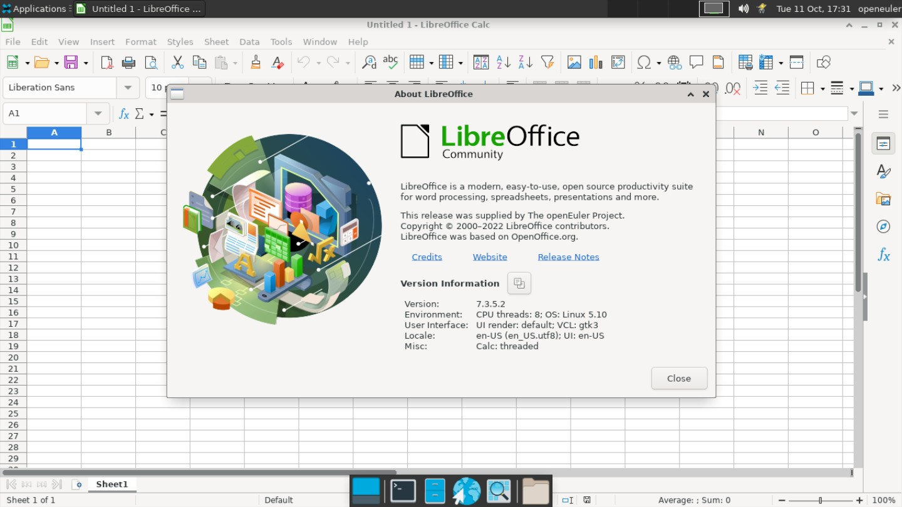

# LibreOffice Calc使用说明

ibreOffice Calc（又称Calc)是LibreOffice生产力软件的项目之一,可用于计算、分析和管理数据,也可用于导入和编辑 Microsoft Excel 电子表格，是与Microsoft Excel功能相当的电子表格软件。

LibreOffice电子表格通常会默认以OpenDocument Format（ODF）的格式存储。但也支持CSV, HTML, SXC, DBF, DIF, UOF, SLK, SDC等格式。

与其他LibreOffice文件一样，“LibreOffice电子表格”可跨平台运行。包含Mac OS X, Microsoft Windows, Linux和FreeBSD等操作系统。

## 1.桌面浏览

Calc在各操作系统上的使用功能都基本相同，主界面分为菜单栏、功能栏以及操作界面。

### 1.1 菜单栏

菜单栏可以帮助您达成各项功能实现，本文档将帮助您了解每项菜单栏所包含的功能。

#### 文件

- 这些命令适用于当前文档，打开新的文档，或者关闭应用程序。
  
#### 编辑

- 该菜单包含了用于编辑当前文档内容的命令。

#### 视图

- 该菜单包含了用于控制文档在屏幕上的显示的命令。

#### 插入

- 插入菜单包含用于向当前工作表中插入新元素的命令，如图像、文本框、对象、媒体、单元格名称等各种元素。

#### 格式

- 「格式」菜单包含了用于为选中单元格、对象以及单元格内容设置格式的命令。

#### 工作表

- 该菜单包含用于修改和管理工作表及其元素的命令。

#### 数据

- 使用「数据」菜单命令编辑当前工作表中的数据。您可以定义区域、排序和筛选数据、计算结果、进行数据分组和创建透视表。

#### 工具

- 工具菜单包含检查拼写、跟踪工作表引用、查找错误和定义方案的命令。

#### 窗口

- 有用于操控和显示文档窗口的命令。

#### 「帮助」菜单

- 「帮助」菜单用于启动和控制 LibreOffice 的帮助系统。

## 2.基本用法

### 2.1 格式化工作表和单元格

#### 2.1.1 冻结行或列，作为表头

如果工作表行或列中的数据很长，超出了可见范围，那么您可以将一些行或列冻结，这样您在滚动工作表时就始终能看到被冻结的行或列。

选择您要冻结的行的下面一行，或者您要冻结的列的右侧一列。这种情况下，上面的行或者左侧的列将会被冻结。

要同时冻结行和列，请选择您要冻结的行的下部与列的右侧交叉处的「单元格」。

冻结操作：点击 View - Freeze Rows and Columns

冻结完成后效果：

#### 2.1.2 高亮显示负数

您可以数字格式 (负数用红色高亮显示) 来格式化单元格。也可以自己定义数字格式，将负数用其他颜色高亮显示。

选择单元格，然后选择「格式 - 单元格」。

在「数字」选项卡中，选择数字格式，并选中「用红色显示负值」复选框。点击「确定」。

单元格的数字格式由两部分组成。分号前是正数和零的格式；分号后是负数的格式。可以在「格式码」下更改代码 (RED)。例如，输入「YELLOW」代替 RED。如果点击「添加」图标后，新的代码显示在列表中，则表示该条目有效。

#### 2.1.3 采用货币格式的单元格

在「LibreOffice Calc 中，可以为数字指定任意货币格式。点击「格式」工具栏中的「货币」图标 图标 设置数字格式时，会将「」工具 - 选项 - 语言设置 - 语言」下设置的默认货币格式指定给单元格。

#### 2.1.4 自动补全文本或数字

向单元格输入数据时，LibreOffice Calc 会检查同一列中与输入内容相匹配的已有内容，并以填充的形式自动推荐。该功能被称作「自动补全」。

要打开或关闭「自动补全」功能，请选中或取消选中「工具 - 自动补全」。

#### 2.1.5 单词替换

在输入的单词总是会被替换成另外的词时，为了避免发生这种情况，可以选择「工具 - 自动更正 - 自动更正选项」，在「替换」选项卡中，双击选择一个单词对，然后点击「删除」。

#### 2.1.6 引号替换

在想将引号替换为自定义引号时，可以选择「工具 - 自动更正 -自动更正选项」。转到「本地化选项」选项卡并取消选中「替换」。

#### 2.1.7 取消首字母大写

如果遇到单元格中的首字母总是被自动转换为大写的情况时，可以选择「工具 - 自动更正 - 自动更正选项」。转到「选项」选项卡。取消选中「每句句首字母大写」。

#### 2.1.8 自动转换为日期格式

LibreOffice Calc 会自动将某些输入项目转换为日期格式。比如，取决于当前locale的设置，输入「1-1」可能会被转换为当前年份的1月1日，并以日期格式显示在单元格中。如果想让输入的项目被当做文本而不是日期，可在输入时在前面加一个撇号 (')。该撇号在单元格中不会显示。

想要更改此选项，可以选择「工具 - 选项 - 语言设定」

#### 2.1.9 自动套用

此功能可以使自动套用格式功能快速将格式应用到选定的单元格区域。

1、将自动套用格式应用于选定的单元格区域，选择要应用自动套用格式样式的单元格范围。范围的大小必须至少为 3 列和 3 行。

2、转到格式 - 自动套用格式样式以打开自动套用格式对话框。

3、在格式列表中选择要应用的自动套用格式样式。

4、在“格式”部分中，从“自动套用格式”样式中选择要应用于所选单元格区域的属性。

5、单击确定以应用自动套用格式样式并关闭对话框。

#### 2.1.10 复制到多个工作表

在 LibreOffice Calc 中，可以插入数值、文字或公式，同时将其复制到文档中其他的选中工作表。

- 按下「Ctrl」键并点击工作空间底部仍为灰色状态的对应注册标签。所选的注册标签都将变白。您可以通过键盘上的「Shift+Ctrl+向上翻页 或 向下翻页」选中多个工作表。

- 现在当您插入值、文本或公式到活动的工作表中时，它们也会出现在其他选中的工作表中的相同位置。例如，在活动的工作表的单元格「A1」中输入数据后，该数据也会被自动输入到其他任何选中的工作表的单元格「A1」中。

#### 2.1.11 选择多个单元格

- 当想选择多个集中的单元格时

选择一个矩形区域，按住鼠标按钮，从所选区域的一个角拖至它的斜对角。

- 当想选择多个分散的单元格时

选择至少一个单元格。然后按住 Ctrl 键的同时点击其他每一个单元格。

#### 2.1.12 自定义数字格式

您可以定义自己的数字格式，用来显示 LibreOffice Calc 中的数字。

例如，要将数字 10,200,000 显示为 10.2 Million:

1、选择要采用新的自定义格式的单元格。

2、选择「格式 - 单元格 - 数字」。

3、在「分类」列表框中选择「自定义」。

4、在「格式码」文本框中输入以下代码:` 0.0,, "Million" `

5、点击「确定」。

#### 2.1.13 插入和编辑批注

您可以通过选择插入 - 批注为每个单元格指定批注。批注由单元格中的红色小正方形 (批注标记) 来表示。

- 批注在鼠标指针指向单元格时可见。
  

- 当选择了某个单元格时，您可以在该单元格的右键菜单中选择「显示批注」。这样批注就会一直显示在屏幕上，直到您从这个右键菜单中停用「显示批注」命令。
  

- 点击一直显示的批注即可对其进行编辑。如果您删除了一个批注中的全部内容，那么该批注也将被删除。

#### 2.1.14 记录修改

并不是所有的修改都会被记录。例如，将制表符从左对齐修改为右对齐就不会被记录。但是，校对人员所做的所有常规修改都会被记录，例如新增、删除、修改文字、一般格式化等。

要修改追踪修订设置，请选择「工具 - 选项 - LibreOffice Writer - 更改」或「工具 - 选项 - LibreOffice Calc - 更改」。

#### 2.1.15 克隆格式

使用克隆格式工具可以从文本选择或对象复制格式并将格式应用到另一个文本选择或对象。

#### 2.1.16 重命名工作表

设置工作表名称是生成可读且易于理解的电子表格文档的重要功能。此功能实现操作为：

1、双击工作表选项卡或打开其上下文菜单并选择重命名工作表。将出现一个对话框，您可以在其中输入新名称。

2、输入新的工作表名称后请点击「确定」。

3、或者，按住 Alt 键并点击任意工作表名称，然后直接输入新名称。

修改完成后的工作表名得到改变：

#### 2.1.17 修改表格视图

要修改表格视图，在「工具 - 选项 - LibreOffice Calc」菜单条目下，进入「视图」选项卡进行设置：

#### 2.1.18 修改行高或列宽

修改行高或列宽的方式有通过鼠标和通过对话框两种：

- 使用鼠标修改行高或列宽：
  
1、在行标题区域点击当前行下的分隔线，按住鼠标按钮并向下或向上拖动，以改变行高。

2、通过双击行下的分隔线选择最佳行高。

- 使用对话框修改行高或列宽：

1、点击行，使它对准焦点。

2、调用行标题上左页边距的右键菜单命令。您将会看到「行高与最佳行高」命令。选择两者均将打开对话框。

#### 2.1.19 将数字格式化为文本

在 LibreOffice Calc 中，可以将数字格式化为文字。打开单元格或单元格区域的右键菜单，选择「单元格格式 -数字」，然后从「分类」列表中选择「文字」。此后在格式化区域中输入的数字都将解释为文字。显示这些「数字」时将和其他文字一样应用左对齐。

#### 2.1.20 将文本转换为数字

如果可以进行明确的转换，Calc 中的默认设置会将单元格内的文本转换为相应的数值。如果无法进行转换，Calc 返回 #VALUE！错误。

仅转换包括指数在内的整数，并且 ISO 8601 日期和时间在其扩展格式中带有分隔符。其他任何内容，例如带有小数分隔符的小数或 ISO 8601 以外的日期，都不会被转换，因为文本字符串将取决于区域设置。前导和尾随空格被忽略。

以下 ISO 8601 格式会被转换:

    CCYY-MM-DD

    CCYY-MM-DDThh:mm

    CCYY-MM-DDThh:mm:ss

    CCYY-MM-DDThh:mm:ss,s

    CCYY-MM-DDThh:mm:ss.s

    hh:mm

    hh:mm:ss

    hh:mm:ss,s

    hh:mm:ss.s

世纪代码 CC 可能不会省略。而日期与时间的分隔符 T 可能会只用一个空格字符来代替。

如果给定的是日期，则该日期必须为有效的公历日期。在这种情况下，可选的时间范围为 00:00 到 23:59:59.99999...

如果仅给定时间字符串，则该字符串的小时值可以大于 24，而分钟和秒钟的最大值为 59。

#### 2.1.20 选择工作表的主题

LibreOffice Calc 提供了一组预定义的格式化主题，您可以为工作表采用相应的主题。

您无法修改 Calc 中的主题，同时也不能添加主题。但是，当这些主题应用至工作表后，可以修改主题的样式。

在应用某种主题对工作表进行格式化之前，必须保证该工作表的单元格至少已经采用了一种自定义单元格样式。然后，才能在「选择主题」对话框中选择并采用某个主题来修改单元格样式。

要使单元格采用某种自定义单元格样式，请打开「样式」窗口，在其底部的列表框中选择「自定义样式」。将显示现有的自定义单元格样式列表。在「样式」窗口中，双击某个名称，将此样式应用到选中的单元格。

要对电子表格应用主题:

1、点击「工具」栏中的「选择主题」图标。将显示「选择主题」对话框。此对话框列出了整个电子表格的可用主题，而「样式」窗口列出了特定单元格的自定义样式。

2、在「选择主题」对话框中，选择工作表要采用的主题。

3、点击「确定」

一旦您在「选择主题」对话框中选择了另一种主题，用户样式中的部分属性将被采用到当前工作表文档中。您立即可在工作表文档中看到所做的修改。

#### 2.1.21 在单元格中插入换行符

使单元格中文字换行有两种方法：

- 要在电子表格单元格中插入换行符，请按Ctrl + Enter键。

该功能仅在文本编辑光标在单元格内时有效，如果光标在输入行则无效。所以请先双击单元格，然后点击要换行的文本位置。

- 格式化 LibreOffice Calc 单元格以便进行自动换行：

1、选择要自动换行的单元格。

2、选择格式-单元格-对齐。

3、选择「自动换行」。

#### 2.1.22 插入特殊字符

此功能用于在文字中插入特殊字符，例如选中标记、框和电话符号等。

- 要查看所有字符的曲目，请选择插入 - 特殊字符。

- 在大选择字段中，双击插入到当前文档中的所需字符。

- 在任意文本输入字段 (如「查找与替换」对话框中的输入字段) 中，您可以通过按 Shift+Ctrl+S 组合键打开「特殊字符」对话框。

#### 2.1.23 修改文字的颜色

单击“字体颜色”图标旁边的箭头以激活一个工具栏，您可以从中选择一系列颜色。

#### 2.1.24 旋转文字

1、选中要旋转其中文字的单元格。

2、选择「格式 - 单元格」。将显示「单元格格式」对话框。

3、点击「对齐」选项卡。

4、在「文字方向」区域，使用鼠标在轮状预览区域选择文字旋转的方向。点击「确定」。

#### 2.1.25 给文本添加上标或下标

1、在单元格中选中要作为上标或下标的字符。例如，如果要输入 H20，其中 2 为下标，请在单元格 (而不是在输入行中) 中选择 2。

2、打开选中字符的右键菜单，选择「字符」。「字符」对话框打开。

3、点击「字体位置」选项卡。

4、选择「下标」选项并点击「确定」。

#### 2.1.26 使用四舍五入的数字

在 LibreOffice Calc 中，所有的十进制数字都按两位取整显示。想要修改数字格式时可分为三种情况

- 要修改选中的单元格

1、标记出您想对其数字格式做修改的所有单元格。

2、选择「格式 - 单元格」，转到「数字」选项卡页面。

3、在「类别字段中选择「数字」。在「选项」中修改小数点位数」中的数值并点击「确定」关闭此对话框。

#### 2.1.27 应用条件格式

要应用条件格式，必须启用自动计算。请选择「工具 - 单元格内容 - 自动计算」 (启用自动计算后，将会看到该命令旁边的复选标记)。

使用条件格式，可以高亮显示超过总计平均值的总计。如果总计改变，则格式也相应改变，无需手动应用其他样式。

使用方法：

1、选择要应用条件样式的单元格。

2、选择Format - Conditional - Condition.

3、在对话框中输入条件。

#### 2.1.28 根据公式指定的格式

可以将 STYLE() 函数添加到单元格的现有公式中。例如，与 CURRENT 函数一起使用时，您可以根据其值来为单元格上色。对于公式 =...+STYLE(IF(CURRENT()>3; "Red"; "Green"))，如果值大于 3，则为单元格应用单元格样式「红色」，否则将应用单元格样式「绿色」。

如果希望选中区域中的所有单元格都应用某个公式，您可以使用「查找与替换」对话框。

1、选出所有您需要的单元格。

2、选择菜单命令「编辑 - 查找与替换」。

3、对于「查找项，请输入: .*」

".*" 是一种常规表达式，指代当前单元格中的内容。

4、在「替换」字段中输入以下公式:「=&+STYLE(IF(CURRENT()>3;"Red";"Green"))」

「&」符号指代「查找」字段的当前内容。因为它是公式，所以在行开头必须输入等号。并且假设已经存在「Red」和「Green」两种单元格样式。

5、选中正则表达式和「仅在当前选中范围内」字段。点击「查找全部」。

选择中所有带内容的单元格被高亮显示。

6、点击「打开」。
