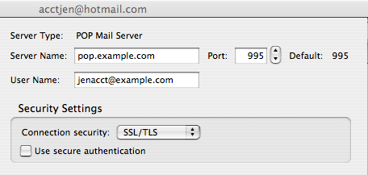
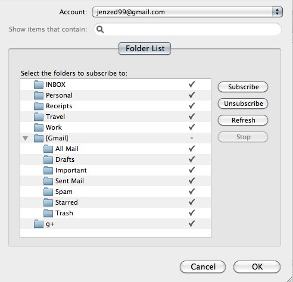

# Thunderbird使用说明

## 1. 概述

Mozilla Thunderbird是由Mozilla Foundation开发的免费开源跨平台电子邮件客户端、个人信息管理器、新闻客户端、RSS和聊天客户端。

## 2. 基本特点

Thunderbird是一个电子邮件、新闻组、新闻提要和聊天 ( XMPP / IRC ) 客户端，具有个人信息管理器(PIM) 功能。

1. 消息管理

Thunderbird 管理多个电子邮件、新闻组和新闻提要帐户，并支持帐户内的多个身份。快速搜索、保存的搜索文件夹（“虚拟文件夹”）、高级邮件过滤、邮件分组和标签等功能有助于管理和查找邮件。在基于Linux的系统上，Thunderbird 为特定系统的新电子邮件通知提供基本支持，并且可以使用附加组件扩展高级通知支持。

2. 垃圾过滤

Thunderbird 包含一个垃圾邮件过滤器，一个基于所包含地址簿的白名单，并且还可以通过基于服务器的过滤器来分类。

3. 扩展和主题

扩展允许通过附加组件网站安装XPInstall模块（称为“XPI”或“zippy”安装）来添加功能，该附加组件还具有更新扩展功能的更新功能。

Thunderbird 支持多种主题来改变其整体外观。这些CSS和图像文件包可以通过 Mozilla Add-ons 的插件网站下载。

4. 标准支持

Thunderbird 遵循电子邮件的行业标准：

- 流行音乐。基本的电子邮件检索协议。
- 地图。除了添加自己的扩展和 Google 和 Apple 的事实上的标准之外，Thunderbird 在 IMAP 中实现了许多功能。
- LDAP地址。
- S/MIME：内置支持使用集中式证书颁发机构提供的 X.509 密钥进行电子邮件加密和签名。
- OpenPGP ：内置支持电子邮件加密和签名。
- 支持Atom和RSS。
- 聊天支持IRC和XMPP协议。
- 新闻使用NNTP并支持 NNTPS。

5. 支持的文件格式

Thunderbird 使用插件提供邮箱格式支持，支持的邮箱格式为：

- mbox  – Unix 邮箱格式（一个文件包含许多电子邮件）
- maildir  – 称为 maildir-lite（每封电子邮件一个文件）。

6. 大文件链接

Thunderbird 集成了对自动链接大文件的支持，而不是将它们直接附加到邮件消息中。

7. HTML 格式化和代码插入

Thunderbird 提供了一个所见即所得的编辑器，用于编写 HTML 格式的消息（默认）。传送格式自动检测功能将以纯文本形式发送未格式化的消息（由用户首选项控制）。格式菜单中提供了某些特殊格式，例如下标、上标和删除线。插入 > HTML 菜单提供了编辑消息的HTML源代码的能力。基本支持 HTML 模板消息，这些消息存储在每个帐户的专用模板文件夹中。

8. 限制和已知问题

与任何软件一样，所代表的文件和对象的数量和大小可能存在限制。例如，POP3文件夹受到文件系统设计限制，例如不支持大文件的文件系统上的最大文件大小，以及可能存在的长文件名限制等问题。

9. 国际化和本地化

Thunderbird 已被翻译成超过 65 种语言，Thunderbird 还不支持SMTPUTF8 (RFC 6531) 或电子邮件地址国际化。

10. 安全

Thunderbird 提供安全功能，例如与IMAP和SMTP服务器的TLS/SSL连接。它还通过OpenPGP（使用公钥和私钥）或S/MIME（使用证书）通过数字签名和消息加密为安全电子邮件提供内置支持。这些安全功能中的任何一个都可以通过安装附加扩展来利用智能卡。

可以通过扩展添加其他安全功能。OpenPGP支持需要Enigmail扩展。

可选的安全保护还包括禁用在消息中加载远程图像、仅启用特定媒体类型（清理程序）和禁用JavaScript。

## 3. 电子邮件

### 3.1 设置电子邮件

在 Thunderbird 上添加和配置您的电子邮件帐户

#### 3.1.1 手动账户配置

当您配置电子邮件帐户时，Thunderbird 通常能够自动完成大部分配置。（有关更多信息，请参阅自动帐户配置。）但是，如果您的电子邮件提供商未在 Thunderbird 的自动配置数据库中列出，或者您有非标准的电子邮件配置，您将需要手动配置您的帐户。此页面将向您显示发送和接收电子邮件所需的基本设置。

如果您自动创建的帐户被分配给 IMAP 而不是 POP 服务器，请参阅常见问题解答将 IMAP 更改为 POP 一文。

要手动配置帐户，您将需要由您的电子邮件提供商提供的以下详细信息。

- 接收邮件服务器和端口（例如，“pop.example.com”和端口 110 或“imap.example.com”和端口 143）
- 外发邮件服务器和端口（例如，“smtp.example.com”和端口 25）
- 与服务器连接的安全设置（例如，“STARTTLS”或“SSL/TLS”以及是否使用安全身份验证）

首先，打开帐户设置：在 Thunderbird 菜单栏中，单击工具菜单并选择帐户设置，或单击应用程序菜单按钮并从子菜单中新的外汇菜单选择选项和帐户设置。每个已配置的电子邮件或新闻组帐户都列在“帐户设置”对话框的左侧。这些帐户对应于“所有文件夹”列表中显示的顶级文件夹。

在左窗格的底部，单击“帐户操作”按钮并选择“添加邮件帐户...”。

输入您的电子邮件帐户详细信息，然后按继续。Thunderbird 将尝试根据您的电子邮件地址的域部分（即“@”符号后面的部分）来确定您的帐户设置。然后按手动配置并编辑服务器名称、端口和 IMAP/POP 以手动设置帐户。单击重新测试以测试您的手动设置；应该有一个快速响应，表明设置是有效的。如果没有，请按停止按钮中止查找，然后编辑服务器名称、端口和 IMAP/POP 并再次单击重新测试。（或者，您可以允许查找收集默认帐户详细信息，然后稍后手动更改设置。）

##### 配置传出服务器

多个电子邮件帐户可以使用同一个传出 SMTP 服务器。因此，SMTP 服务器是与电子邮件帐户分开创建的。在“帐户设置”对话框的左侧窗格中，从列表底部选择传出服务器 (SMTP) 。列表中有一个条目是在您输入帐户详细信息时创建的。编辑该条目或添加新条目。

作为另一个示例，Gmail 帐户配置如下：

- 服务器名称：smtp.gmail.com
- 端口：587
- 使用名称和密码：选中
- 用户名：您的 gmail 用户 ID，不带“@gmail.com”扩展名（例如，如果您的电子邮件地址是 brian@gmail.com，那么您的用户名是“brian”）。如果您使用的是 Google Apps for Domains，请使用您的完整地址（例如，“billsmith@yourdomain.com”）。
- 连接安全：STARTTLS

保存有关新发送服务器的信息后，从列表中选择您的新电子邮件帐户。在传出服务器 (SMTP)字段中，从下拉列表中选择 SMTP 服务器。当您输入帐户详细信息时，页面上的其他项目会自动创建 - 根据需要进行更改和扩展。

单击新帐户下的服务器设置选项。确保以下字段中的条目与您的电子邮件提供商提供给您的设置相对应：

保存这些更改后，您应该能够发送和接收电子邮件了。

#### 3.2 Gmail的配置

要将 Thunderbird 配置为使用 Gmail，首先在您的 Gmail 帐户上启用 IMAP。请参阅Gmail 的说明以获取帮助。（默认情况下，IMAP 在新的 Gmail 帐户上启用。）

接下来，选择文件 > 新建 > 现有邮件帐户...。将显示“邮件帐户设置”对话框。在您提供帐户信息（真实姓名、电子邮件地址和密码）后，Thunderbird 将自动配置您的 Gmail 连接。点击完毕，如果出现提示，请使用您的 Google 帐户登录，仅此而已！Thunderbird 将下载您现有的邮件，您的 Gmail 将可供使用。

1. Gmail 的特殊性

- 归档消息

为了与 Gmail 的行为保持一致，Thunderbird 将您的邮件存档在“所有邮件”文件夹中，而不是像其他帐户那样存档在“存档”文件夹中（如存档邮件文章中所述）

- 订阅文件夹和同步消息

了解 Gmail 标签和 Thunderbird 文件夹

Gmail 使用 IMAP 的特殊实现。在此实施中，Gmail 标签成为 Thunderbird 文件夹。当您在 Gmail 中为邮件应用标签时，Thunderbird 会创建一个与标签同名的文件夹并将邮件存储在该文件夹中。同样，如果您将邮件移动到 Thunderbird 中的文件夹，Gmail 将创建一个带有文件夹名称的标签并将其分配给邮件。

在下面显示的示例中，与“ [Gmail] ”文件夹处于同一级别的文件夹（“g+”、“个人”、“收据”、“旅行”和“工作”）对应于 Gmail 标签。

“ [Gmail] ”文件夹还有一组特殊的子文件夹：

    - 所有邮件：包含您 Gmail 帐户中的所有邮件，包括已发送和存档的邮件。您在收件箱中看到的任何邮件也将出现在[Gmail]/所有邮件文件夹中。
    - 草稿：包含草稿消息。
    - 已发送邮件：包含已发送的消息。
    - 垃圾邮件：包含被标记为垃圾邮件的邮件（由 Gmail 或 Thunderbird 标记）。
    - 已加星标：包含已加星标的邮件（通过 Gmail 或 Thunderbird）。
    - 垃圾箱：包含已删除的邮件。
    - 重要：包含 Gmail 标记为“重要”的邮件。（有关此 Gmail 功能的更多详细信息，请参阅优先收件箱概述。）

- 订阅或取消订阅文件夹（标签）

您可以配置要在 Thunderbird 中显示的 Gmail 文件夹。默认情况下会显示所有 Gmail 文件夹，如上所述。要配置文件夹显示，请右键单击帐户名称并选择订阅。

取消选中您不想在 Thunderbird 中显示的任何文件夹。邮件仍将通过“所有邮件”文件夹下载并可用。它们也将包含在搜索结果中。但是，不会显示 Gmail 标签（Thunderbird 文件夹）。

- 同步文件夹（标签）

如果您想在 Thunderbird 中查看所有 Gmail 标签和邮件，但希望避免将所有邮件下载到您的系统，您可能需要调整同步设置。这允许您定义应同步的文件夹。如果不同步文件夹，Thunderbird 中仍会显示邮件头，但只有点击邮件头时才会下载邮件内容。

要更改下载消息的方式，请为帐户和单个文件夹设置同步选项。（工具 > 帐户设置...）有关详细信息，请参阅IMAP 同步。

- 有用的附加组件

如果您想在 Thunderbird 和 Gmail 之间同步您的联系人，您应该尝试使用Google 联系人或gContactSync插件。

如果您想在 Lightning 和 Google 日历之间同步您的日历，您应该阅读将 Lightning 与 Google 日历一起使用。

平面文件夹树有助于在与其他文件夹相同的级别显示 [Gmail] IMAP 文件夹的所有子文件夹。

Gmail 按钮可让您更轻松地将邮件移至“垃圾邮件”和“垃圾邮件”文件夹。测试版还显示每封邮件的所有 Gmail 标签。

#### 自动帐户配置

使用 Thunderbird 设置新帐户很容易。您需要做的就是提供您的电子邮件提供商的用户名和密码以及您的电子邮件地址。Thunderbird 通过在包含所有主要互联网服务提供商 (ISP) 的连接信息的数据库中查找您的电子邮件提供商来确定连接详细信息（例如端口、服务器名称、安全协议等）。在确定您的帐户提供者（在您的电子邮件地址中的“@”符号后指定）后，Thunderbird 通常可以提供帐户详细信息。

    您的计算机必须连接到 Internet，Thunderbird 才能自动创建您的帐户。

安装后第一次打开 Thunderbird 时，系统会提示您创建配置文件。（在此阶段关闭任何建议设置电子邮件服务的窗口并继续）。接下来，您将被要求在下面显示的对话框中提供有关您的电子邮件帐户的详细信息。添加新电子邮件帐户时也会显示该对话框（使用File > New > Existing Mail Account...或通过Account Settings）。添加新帐户的另一种方法是单击现有帐户名称（显示的电子邮件地址）。在“帐户”标题下有两个选项：“查看此帐户的设置”和“设置帐户”。在“设置帐户”下，单击“电子邮件”

当你点击继续，Thunderbird 将查找电子邮件提供商并尝试确定服务器设置。

## 4. 联系人

## 5. 安装、迁移和更新

## 6. 隐私和安全设置

## 7. 自定义控件、选项和附加组件

## 8. 日历

## 9. 新闻提要 (RSS)、博客和社交

## 10. 技巧和窍门
