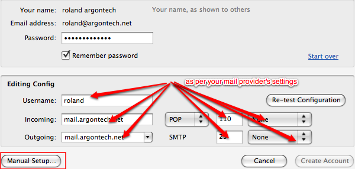
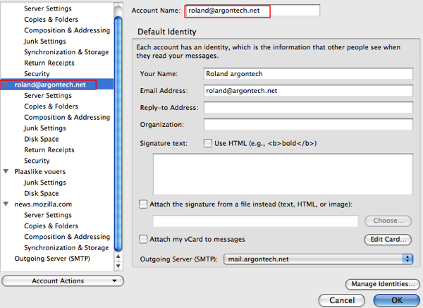

# Thunderbird使用说明

## 1. 概述

Mozilla Thunderbird是由Mozilla Foundation开发的免费开源跨平台电子邮件客户端、个人信息管理器、新闻客户端、RSS和聊天客户端。

## 2. 基本特点

Thunderbird是一个电子邮件、新闻组、新闻提要和聊天 ( XMPP / IRC ) 客户端，具有个人信息管理器(PIM) 功能。

1. 消息管理

Thunderbird 管理多个电子邮件、新闻组和新闻提要帐户，并支持帐户内的多个身份。快速搜索、保存的搜索文件夹（“虚拟文件夹”）、高级邮件过滤、邮件分组和标签等功能有助于管理和查找邮件。在基于Linux的系统上，Thunderbird 为特定系统的新电子邮件通知提供基本支持，并且可以使用附加组件扩展高级通知支持。

2. 垃圾过滤

Thunderbird 包含一个垃圾邮件过滤器，一个基于所包含地址簿的白名单，并且还可以通过基于服务器的过滤器来分类。

3. 扩展和主题

扩展允许通过附加组件网站安装XPInstall模块（称为“XPI”或“zippy”安装）来添加功能，该附加组件还具有更新扩展功能的更新功能。

Thunderbird 支持多种主题来改变其整体外观。这些CSS和图像文件包可以通过 Mozilla Add-ons 的插件网站下载。

4. 标准支持

Thunderbird 遵循电子邮件的行业标准：

- 流行音乐。基本的电子邮件检索协议。
- 地图。除了添加自己的扩展和 Google 和 Apple 的事实上的标准之外，Thunderbird 在 IMAP 中实现了许多功能。
- LDAP地址。
- S/MIME：内置支持使用集中式证书颁发机构提供的 X.509 密钥进行电子邮件加密和签名。
- OpenPGP ：内置支持电子邮件加密和签名。
- 支持Atom和RSS。
- 聊天支持IRC和XMPP协议。
- 新闻使用NNTP并支持 NNTPS。

5. 支持的文件格式

Thunderbird 使用插件提供邮箱格式支持，支持的邮箱格式为：

- mbox  – Unix 邮箱格式（一个文件包含许多电子邮件）
- maildir  – 称为 maildir-lite（每封电子邮件一个文件）。

6. 大文件链接

Thunderbird 集成了对自动链接大文件的支持，而不是将它们直接附加到邮件消息中。

7. HTML 格式化和代码插入

Thunderbird 提供了一个所见即所得的编辑器，用于编写 HTML 格式的消息（默认）。传送格式自动检测功能将以纯文本形式发送未格式化的消息（由用户首选项控制）。格式菜单中提供了某些特殊格式，例如下标、上标和删除线。插入 > HTML 菜单提供了编辑消息的HTML源代码的能力。基本支持 HTML 模板消息，这些消息存储在每个帐户的专用模板文件夹中。

8. 限制和已知问题

与任何软件一样，所代表的文件和对象的数量和大小可能存在限制。例如，POP3文件夹受到文件系统设计限制，例如不支持大文件的文件系统上的最大文件大小，以及可能存在的长文件名限制等问题。

9. 国际化和本地化

Thunderbird 已被翻译成超过 65 种语言，Thunderbird 还不支持SMTPUTF8 (RFC 6531) 或电子邮件地址国际化。

10. 安全

Thunderbird 提供安全功能，例如与IMAP和SMTP服务器的TLS/SSL连接。它还通过OpenPGP（使用公钥和私钥）或S/MIME（使用证书）通过数字签名和消息加密为安全电子邮件提供内置支持。这些安全功能中的任何一个都可以通过安装附加扩展来利用智能卡。

可以通过扩展添加其他安全功能。OpenPGP支持需要Enigmail扩展。

可选的安全保护还包括禁用在消息中加载远程图像、仅启用特定媒体类型（清理程序）和禁用JavaScript。

## 3. 电子邮件

### 3.1 设置电子邮件

在 Thunderbird 上添加和配置您的电子邮件帐户

#### 3.1.1 手动账户配置

当您配置电子邮件帐户时，Thunderbird 通常能够自动完成大部分配置。（有关更多信息，请参阅自动帐户配置。）但是，如果您的电子邮件提供商未在 Thunderbird 的自动配置数据库中列出，或者您有非标准的电子邮件配置，您将需要手动配置您的帐户。此页面将向您显示发送和接收电子邮件所需的基本设置。

如果您自动创建的帐户被分配给 IMAP 而不是 POP 服务器，请参阅常见问题解答将 IMAP 更改为 POP 一文。

要手动配置帐户，您将需要由您的电子邮件提供商提供的以下详细信息。

- 接收邮件服务器和端口（例如，“pop.example.com”和端口 110 或“imap.example.com”和端口 143）
- 外发邮件服务器和端口（例如，“smtp.example.com”和端口 25）
- 与服务器连接的安全设置（例如，“STARTTLS”或“SSL/TLS”以及是否使用安全身份验证）

首先，打开帐户设置：在 Thunderbird 菜单栏中，单击工具菜单并选择帐户设置，或单击应用程序菜单按钮并从子菜单中新的外汇菜单选择选项和帐户设置。每个已配置的电子邮件或新闻组帐户都列在“帐户设置”对话框的左侧。这些帐户对应于“所有文件夹”列表中显示的顶级文件夹。

在左窗格的底部，单击“帐户操作”按钮并选择“添加邮件帐户...”。

输入您的电子邮件帐户详细信息，然后按继续。Thunderbird 将尝试根据您的电子邮件地址的域部分（即“@”符号后面的部分）来确定您的帐户设置。然后按手动配置并编辑服务器名称、端口和 IMAP/POP 以手动设置帐户。单击重新测试以测试您的手动设置；应该有一个快速响应，表明设置是有效的。如果没有，请按停止按钮中止查找，然后编辑服务器名称、端口和 IMAP/POP 并再次单击重新测试。（或者，您可以允许查找收集默认帐户详细信息，然后稍后手动更改设置。）

##### 配置传出服务器

多个电子邮件帐户可以使用同一个传出 SMTP 服务器。因此，SMTP 服务器是与电子邮件帐户分开创建的。在“帐户设置”对话框的左侧窗格中，从列表底部选择传出服务器 (SMTP) 。列表中有一个条目是在您输入帐户详细信息时创建的。编辑该条目或添加新条目。

作为另一个示例，Gmail 帐户配置如下：

- 服务器名称：smtp.gmail.com
- 端口：587
- 使用名称和密码：选中
- 用户名：您的 gmail 用户 ID，不带“@gmail.com”扩展名（例如，如果您的电子邮件地址是 brian@gmail.com，那么您的用户名是“brian”）。如果您使用的是 Google Apps for Domains，请使用您的完整地址（例如，“billsmith@yourdomain.com”）。
- 连接安全：STARTTLS

保存有关新发送服务器的信息后，从列表中选择您的新电子邮件帐户。在传出服务器 (SMTP)字段中，从下拉列表中选择 SMTP 服务器。当您输入帐户详细信息时，页面上的其他项目会自动创建 - 根据需要进行更改和扩展。

单击新帐户下的服务器设置选项。确保以下字段中的条目与您的电子邮件提供商提供给您的设置相对应：

保存这些更改后，您应该能够发送和接收电子邮件了。

#### 3.2 Gmail的配置

要将 Thunderbird 配置为使用 Gmail，首先在您的 Gmail 帐户上启用 IMAP。请参阅Gmail 的说明以获取帮助。（默认情况下，IMAP 在新的 Gmail 帐户上启用。）

接下来，选择文件 > 新建 > 现有邮件帐户...。将显示“邮件帐户设置”对话框。在您提供帐户信息（真实姓名、电子邮件地址和密码）后，Thunderbird 将自动配置您的 Gmail 连接。点击完毕，如果出现提示，请使用您的 Google 帐户登录，仅此而已！Thunderbird 将下载您现有的邮件，您的 Gmail 将可供使用。

1. Gmail 的特殊性

- 归档消息

为了与 Gmail 的行为保持一致，Thunderbird 将您的邮件存档在“所有邮件”文件夹中，而不是像其他帐户那样存档在“存档”文件夹中（如存档邮件文章中所述）

- 订阅文件夹和同步消息

了解 Gmail 标签和 Thunderbird 文件夹

Gmail 使用 IMAP 的特殊实现。在此实施中，Gmail 标签成为 Thunderbird 文件夹。当您在 Gmail 中为邮件应用标签时，Thunderbird 会创建一个与标签同名的文件夹并将邮件存储在该文件夹中。同样，如果您将邮件移动到 Thunderbird 中的文件夹，Gmail 将创建一个带有文件夹名称的标签并将其分配给邮件。

在下面显示的示例中，与“ [Gmail] ”文件夹处于同一级别的文件夹（“g+”、“个人”、“收据”、“旅行”和“工作”）对应于 Gmail 标签。

“ [Gmail] ”文件夹还有一组特殊的子文件夹：

    - 所有邮件：包含您 Gmail 帐户中的所有邮件，包括已发送和存档的邮件。您在收件箱中看到的任何邮件也将出现在[Gmail]/所有邮件文件夹中。
    - 草稿：包含草稿消息。
    - 已发送邮件：包含已发送的消息。
    - 垃圾邮件：包含被标记为垃圾邮件的邮件（由 Gmail 或 Thunderbird 标记）。
    - 已加星标：包含已加星标的邮件（通过 Gmail 或 Thunderbird）。
    - 垃圾箱：包含已删除的邮件。
    - 重要：包含 Gmail 标记为“重要”的邮件。（有关此 Gmail 功能的更多详细信息，请参阅优先收件箱概述。）

- 订阅或取消订阅文件夹（标签）

您可以配置要在 Thunderbird 中显示的 Gmail 文件夹。默认情况下会显示所有 Gmail 文件夹，如上所述。要配置文件夹显示，请右键单击帐户名称并选择订阅。

取消选中您不想在 Thunderbird 中显示的任何文件夹。邮件仍将通过“所有邮件”文件夹下载并可用。它们也将包含在搜索结果中。但是，不会显示 Gmail 标签（Thunderbird 文件夹）。

- 同步文件夹（标签）

如果您想在 Thunderbird 中查看所有 Gmail 标签和邮件，但希望避免将所有邮件下载到您的系统，您可能需要调整同步设置。这允许您定义应同步的文件夹。如果不同步文件夹，Thunderbird 中仍会显示邮件头，但只有点击邮件头时才会下载邮件内容。

要更改下载消息的方式，请为帐户和单个文件夹设置同步选项。（工具 > 帐户设置...）有关详细信息，请参阅IMAP 同步。

- 有用的附加组件

如果您想在 Thunderbird 和 Gmail 之间同步您的联系人，您应该尝试使用Google 联系人或gContactSync插件。

如果您想在 Lightning 和 Google 日历之间同步您的日历，您应该阅读将 Lightning 与 Google 日历一起使用。

平面文件夹树有助于在与其他文件夹相同的级别显示 [Gmail] IMAP 文件夹的所有子文件夹。

Gmail 按钮可让您更轻松地将邮件移至“垃圾邮件”和“垃圾邮件”文件夹。测试版还显示每封邮件的所有 Gmail 标签。

#### 自动帐户配置

使用 Thunderbird 设置新帐户很容易。您需要做的就是提供您的电子邮件提供商的用户名和密码以及您的电子邮件地址。Thunderbird 通过在包含所有主要互联网服务提供商 (ISP) 的连接信息的数据库中查找您的电子邮件提供商来确定连接详细信息（例如端口、服务器名称、安全协议等）。在确定您的帐户提供者（在您的电子邮件地址中的“@”符号后指定）后，Thunderbird 通常可以提供帐户详细信息。

    您的计算机必须连接到 Internet，Thunderbird 才能自动创建您的帐户。

安装后第一次打开 Thunderbird 时，系统会提示您创建配置文件。（在此阶段关闭任何建议设置电子邮件服务的窗口并继续）。接下来，您将被要求在下面显示的对话框中提供有关您的电子邮件帐户的详细信息。添加新电子邮件帐户时也会显示该对话框（使用File > New > Existing Mail Account...或通过Account Settings）。添加新帐户的另一种方法是单击现有帐户名称（显示的电子邮件地址）。在“帐户”标题下有两个选项：“查看此帐户的设置”和“设置帐户”。在“设置帐户”下，单击“电子邮件”

当你点击继续，Thunderbird 将查找电子邮件提供商并尝试确定服务器设置。

在上述情况下，提供者数据已用于填写帐户详细信息并配置所提供的服务：

- 接收邮件：imap.gmx.net 上的 IMAP，使用安全套接字层 (SSL)
- 外发邮件：mail.gmx.net 上的 SMTP，使用 SSL

您可以选择 IMAP 或 POP 作为您的传入邮件协议。IMAP 和 POP 是检索电子邮件的标准协议。IMAP 是一种更现代的协议，允许您同时在邮件服务器和本地计算机上存储消息。POP 协议只允许本地存储消息。电子邮件提供商可以通过 IMAP 或 POP 协议提供访问，也可以同时支持这两种协议。（要更好地了解这两种协议的技术细节，请参阅术语表，包括帐户类型和IMAP 同步。）

要完成帐户设置：

- 创建账户：单击此按钮创建一个新帐户。
- 取消：中止帐户的自动设置。
- 手动设置...：手动配置帐户。Thunderbird 将使用显示的详细信息创建一个新帐户，然后打开“帐户设置”对话框，以便您进行进一步更改。（请参阅手动帐户配置以获取帮助。）

创建帐户后，Thunderbird 将显示新帐户：

如果您的帐号无法被 Thunderbird 自动配置，您必须手动配置。这是通过从工具菜单访问的帐户设置对话框完成的。您的电子邮件帐户提供商可以提供有关连接信息的详细信息。（这些信息可能可以从他们的网站获得。）请参阅手动帐户配置文章以获取完整说明。如果您需要将传入服务器从 IMAP更改为 POP，请参阅常见问题解答将 IMAP更改为 POP。

#### 将 IMAP 更改为 POP

从 Thunderbird 3 开始，新的自动帐户配置向导可以帮助您配置与电子邮件提供商的连接，但前提是您的提供商在 Mozilla 的 Internet 服务提供商数据库中或被 Thunderbird 认可。虽然包括了大多数大型提供商，但许多较小的提供商尚未包含在帐户配置数据库中。

如果您的邮件服务器同时支持 IMAP 和 POP，Thunderbird 将默认使用 IMAP。还支持 POP，但必须使用以下说明手动配置：

本文档将向您展示如何为 POP 访问（而不是 IMAP）配置新帐户。无法转换现有的 IMAP 帐户。删除说明在本文末尾。

1. 选择工具 > 帐户设置... > 帐户操作 > 添加邮件帐户。

2. 输入您的用户名（与您的邮件提供商核实；这是您的完整电子邮件地址）和密码，然后单击继续。

3. Thunderbird 将尝试使用 IMAP 自动配置您的帐户设置。单击停止。

4. 输入您的帐户详细信息，如下所示：

- 用户名：输入您的完整电子邮件地址（或您的电子邮件提供商推荐的任何内容，通常是您的完整电子邮件地址，尽管有时只是“@”之前的部分）。
- 传入：输入您的传入电子邮件提供商的服务器（通常是“ mail.yourmailprovider.com ”或“ pop.yourmailprovider.com ”，例如“ mail.argontech.net ”）。
- 传出：输入您的传出邮件提供商的服务器（通常是“ mail.domainname.com ”或“ smtp.domainname.com ”）。
- 从接收邮件服务器名称右侧的下拉列表中选择“POP”（屏幕截图中标记为“Incoming:”的行）。这很重要，因为如果选择了 IMAP，您以后将无法将其更改为 POP！
- 传入端口号：这取决于电子邮件提供商。
- 传出端口号：这取决于电子邮件提供商。
- 传入安全性：这取决于电子邮件提供商。
- 传出安全性：这取决于电子邮件提供商。

5. 输入这些设置后，单击手动设置

您可能会收到一条错误消息，指出 SMTP 帐户已存在。清除消息。

6. 单击“取消”退出“帐户设置”对话框。重新打开帐户设置页面，您将看到您的新帐户已创建。另请检查您的发送服务器 (SMTP) 是否适用于该帐户（在屏幕截图的底部）。

检查您的传入和传出邮件是否正常工作。
如果一切正常（即您可以发送和接收电子邮件并查看旧电子邮件；请注意，某些电子邮件提供商可能不会让您访问您的所有电子邮件或所有电子邮件文件夹；请咨询您的邮件提供商）并且您不小心创建了一个IMAP 帐户，然后按如下方式删除意外创建的 IMAP 帐户：打开工具 > 帐户设置...，使用 IMAP 服务器设置选择意外创建的 IMAP 帐户，然后从帐户下方的下拉列表中选择帐户操作 > 删除帐户列表在左侧。

有关帐户连接信息的更多信息，请参阅手动帐户配置。

#### 手动账户配置

当您配置电子邮件帐户时，Thunderbird 通常能够自动完成大部分配置。（有关更多信息，请参阅自动帐户配置。）但是，如果您的电子邮件提供商未在 Thunderbird 的自动配置数据库中列出，或者您有非标准的电子邮件配置，您将需要手动配置您的帐户。此页面将向您显示发送和接收电子邮件所需的基本设置。

如果您自动创建的帐户被分配给 IMAP 而不是 POP 服务器，请参阅常见问题解答将 IMAP 更改为 POP 一文。

要手动配置帐户，您将需要由您的电子邮件提供商提供的以下详细信息。

- 接收邮件服务器和端口（例如，“pop.example.com”和端口 110 或“imap.example.com”和端口 143）
- 外发邮件服务器和端口（例如，“smtp.example.com”和端口 25）
- 与服务器连接的安全设置（例如，“STARTTLS”或“SSL/TLS”以及是否使用安全身份验证）

首先，打开帐户设置：在 Thunderbird 菜单栏中，单击工具菜单并选择帐户设置，或单击应用程序菜单按钮并从子菜单中新的外汇菜单选择选项和帐户设置。每个已配置的电子邮件或新闻组帐户都列在“帐户设置”对话框的左侧。这些帐户对应于“所有文件夹”列表中显示的顶级文件夹。

在左窗格的底部，单击“帐户操作”按钮并选择“添加邮件帐户...”。

输入您的电子邮件帐户详细信息，然后按继续。Thunderbird 将尝试根据您的电子邮件地址的域部分（即“@”符号后面的部分）来确定您的帐户设置。然后按手动配置并编辑服务器名称、端口和 IMAP/POP 以手动设置帐户。单击重新测试以测试您的手动设置；应该有一个快速响应，表明设置是有效的。如果没有，请按停止按钮中止查找，然后编辑服务器名称、端口和 IMAP/POP 并再次单击重新测试。（或者，您可以允许查找收集默认帐户详细信息，然后稍后手动更改设置。）

- 配置传出服务器

多个电子邮件帐户可以使用同一个传出 SMTP 服务器。因此，SMTP 服务器是与电子邮件帐户分开创建的。在“帐户设置”对话框的左侧窗格中，从列表底部选择传出服务器 (SMTP) 。结果列表中可能有一个条目是在您输入帐户详细信息时创建的。编辑该条目或添加新条目。

作为另一个示例，Gmail 帐户配置如下：

- 服务器名称：smtp.gmail.com
- 端口：587
- 使用名称和密码：选中
- 用户名：您的 gmail 用户 ID，不带“@gmail.com”扩展名（例如，如果您的电子邮件地址是 brian@gmail.com，那么您的用户名是“brian”）。如果您使用的是 Google Apps for Domains，请使用您的完整地址（例如，“billsmith@yourdomain.com”）。
- 连接安全：STARTTLS

保存有关新发送服务器的信息后，从列表中选择您的新电子邮件帐户。在传出服务器 (SMTP)字段中，从下拉列表中选择 SMTP 服务器。当您输入帐户详细信息时，页面上的其他项目会自动创建 - 根据需要进行更改和扩展。

单击新帐户下的服务器设置选项。确保以下字段中的条目与您的电子邮件提供商提供给您的设置相对应：

保存这些更改后，您应该能够发送和接收电子邮件了。

#### 从 POP 切换到 IMAP 帐户

关于IMAP 同步的文章解释了 IMAP 的好处，它是最现代和最广泛使用的电子邮件协议。（POP 是较早的协议，功能较少。）如果您想将现有的 POP 帐户转换为 Thunderbird 中的 IMAP 帐户，请按照以下步骤操作。

- 检查您的邮件提供商是否支持 IMAP

虽然大多数邮件提供商都支持 IMAP，但仍有一些不支持。所以首先确保您的邮件提供商支持 IMAP。

如果您的提供商不支持 IMAP 而您仍想使用 IMAP 帐户，您必须选择一个新的邮件帐户提供商（例如，在 Thunderbird 中支持 IMAP 的那些），创建一个帐户，然后从旧的 POP 中移动您的邮件帐户到您的新 IMAP 帐户，如下所述。

- 禁用您的 POP 帐户

为了避免重复检查新邮件，首先通过打开工具> 帐户设置菜单进入您的帐户设置，然后选择服务器设置并取消选中启动时检查新邮件和每 XX 分钟检查一次新邮件。

- 创建 IMAP 帐户

1. 打开文件 > 新建 > 现有帐户菜单
2. 在助手的帮助下设置您的帐户。
3. 当它询问您是否要使用 POP 或 IMAP 时，选择IMAP（远程文件夹）。

4. 您的新 IMAP 帐户将被创建并显示在您现有邮件帐户的底部。
5. 花时间测试一切是否正常。检查您的特殊文件夹是否被正确识别（即用于存储已发送邮件的文件夹应该有自己的图标，对于Trash、Junk和Draft文件夹也是如此）。

- 将本地消息传输到服务器

如果您的 POP 帐户中有想要通过 IMAP 帐户访问的邮件或文件夹，只需选择它们并通过拖放将它们移动到您的 IMAP 帐户。根据您移动的邮件数量，上传可能需要几分钟时间。要有耐心; 你快完成了。

    或者，您也可以使用 本地文件夹帐户来存储旧电子邮件，而不是将它们移动到 IMAP 服务器，尤其是在 IMAP 服务器的存储容量有限的情况下。

- 删除您的 POP 帐户

如果您要将电子邮件帐户从 POP 转换为 IMAP，当您完全确定已将所有重要邮件移至 IMAP 服务器（或本地文件夹）时，您可以删除 POP 帐户。您无法轻松撤消此操作，因此请确保您确实不再需要存储在此帐户中的消息。

1. 通过打开菜单工具> 帐户设置来打开您的帐户设置，然后选择您的 POP 帐户。
2. 点击帐户操作底部的按钮，然后选择Remove Account。

如果您创建了一个使用 IMAP 的新电子邮件帐户，则无法在不删除电子邮件地址的情况下删除旧的 POP 帐户。在删除 POP 帐户之前，您可能需要通知向您的旧帐户发送邮件的人，他们应该切换到您的新电子邮件地址，并在删除 POP 帐户之前等待一段时间，以确保您不会错过任何消息。

#### Thunderbird 中的邮件目录

Maildir的可选支持允许每封电子邮件有一个唯一的文件（使用EML数据格式），这与称为mbox的每个文件夹一个文件的默认单一文件格式不同。注意 – 这不是完整的 Maildir，因为大多数用户，尤其是 Linux 或邮件管理员，都知道 Maildir。您不能将 Thunderbird 帐户指向邮件服务器目录，也不能将邮件标志与电子邮件一起存储。有关更多详细信息，请参阅wiki。

Maildir 默认情况下是禁用的，因为仍然存在许多错误。它不是 100% 为用户准备好的。

    警告：我们建议您禁用 Maildir，除非您是高级用户，愿意为您的数据冒险，并且知道如何在打开 Maildir 之前 备份您的电子邮件以及在遇到问题时如何恢复它。

本文的其余部分解释了格式更改以及如何测试 Maildir。

Maildir 是 Thunderbird 的一个重大变化，因为它改变了邮件存储机制。每个电子邮件存储格式的单个文件具有显着优势：

备份更容易、更短，因为要备份的数据量减少到只有自上次备份以来发生更改的电子邮件。
防病毒软件可以更轻松地扫描单个文件中的电子邮件，并且可以删除受感染的邮件而不会丢失文件夹中的所有其他邮件，就像今天的防病毒软件无法在一个文件中处理多个电子邮件一样。

- 如何打开邮件目录

    警告：同样，此功能是实验性的，我们建议您在打开 Maildir 之前了解如何提交错误以及如何备份和恢复您的电子邮件。

要打开 Maildir：

1. 备份您的电子邮件。
2. 在 Thunderbird 窗口的顶部，单击工具菜单并选择选项，或单击菜单按钮并选择选项。fx57菜单
3. 选择“高级”面板，然后选择“常规”选项卡。
4. 在新帐户的消息存储类型旁边，选择
每条消息的文件 (maildir)
.
从现在开始创建的任何电子邮件帐户都将使用 Maildir。现有帐户将继续使用 mbox。如果您想再次为新帐户使用 mbox，只需重置配置变量。

要将现有帐户更改为使用 maildir，请参阅此文章。

#### 雷鸟 78.0 中的新功能

本文介绍了 Thunderbird 78.0 版中用户可以看到的一些主要变化和新功能。

- 用于集中帐户设置的新帐户中心

设置 Thunderbird 来处理您的通信现在变得更加容易。新的帐户中心欢迎您使用 Thunderbird 可以处理的所有不同帐户类型、电子邮件、日历、地址簿、聊天、FileLink、新闻源和新闻组的整洁阵容。您还可以从其他程序导入数据。

添加您的第一个帐户后，始终可以使用较小版本的 Account Hub 来添加另一个帐户：在 Thunderbird 主选项卡的文件夹列表中选择任何帐户，您将在那里找到设置另一个帐户和从另一个程序导入部分.

- 改进的电子邮件帐户设置对话框：马上开始！

用于设置现有电子邮件地址以与 Thunderbird 一起使用的对话框已经过重新设计，以提供更好的用户体验。只需输入您的姓名、电子邮件地址和密码，Thunderbird 就会尝试从 Mozilla ISP 数据库中找到正确的配置。一分钟开始使用 Thunderbird！

    您以后可以随时微调您的帐户设置。为方便起见，帐户设置现在显示在选项卡中，任何更改都会立即应用。

- 新地址区

写入窗口的寻址区域已从头开始重新设计，以提供更方便高效的用户体验。而在以前的 Thunderbird 版本中，您可以将不同类型的收件人全部混合在一起，每个收件人一行，而单个地址行现在可以包含多个收件人。因此收件人将自动按类型分组，例如：收件人、抄送（副本）和密件抄送（密件抄送）。这使您更容易一目了然地查看哪些收件人属于哪个组。此外，每个收件人现在都是一个项目，这使得选择多个收件人并对其采取行动更加有效。开发人员有时会开玩笑地将收件人物品称为收件人药丸，因为一开始它们的角非常圆。

- 添加多个相同类型的收件人就像以前一样简单：开始输入您的收件人，自动完成将从您的地址簿中提出建议，然后按进入或者标签完成您的收件人，这将创建一个收件人项目。然后只需在同一行键入另一个并按进入再次。

- 要编辑或更正收件人项目，请使用鼠标或箭头键选择它←
或者→，然后按进入. 完成编辑后，只需按进入再次。

## 4. 联系人

## 5. 安装、迁移和更新

## 6. 隐私和安全设置

## 7. 自定义控件、选项和附加组件

## 8. 日历

## 9. 新闻提要 (RSS)、博客和社交

## 10. 技巧和窍门
