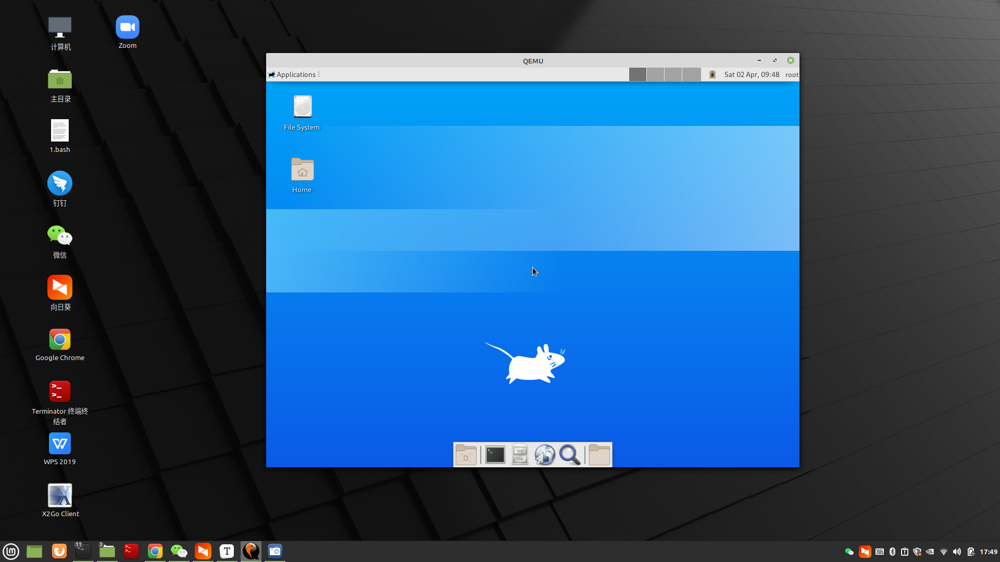

# Xfce安装说明

## 1. 编译支持视频输出的 QEMU

### 1.1 支持视频输出的 QEMU

QEMU代码见https://gitlab.com/wangjunqiang/qemu/-/tree/display

```bash
git clone -b display https://gitlab.com/wangjunqiang/qemu.git
```

### 1.2  安装 qemu-riscv64

> 参考文档：[https://wiki.qemu.org/Documentation/Platforms/RISCV](https://wiki.qemu.org/Documentation/Platforms/RISCV)

#### 1.2.1 Ubuntu 20.04上安装qemu-rv64

在Mint 20.02，内核1 5.4.0-74-generic上验证成功。

##### 1.2.1.1 qemu命令简介

```bash
oem-qemu-meta       # Meta package for QEMU
qemu                # fast processor emulator, dummy package
qemu-system         # QEMU full system emulation binaries
aqemu               # QEMU 和 KVM 的 Qt5 前端
grub-firmware-qemu  # GRUB firmware image for QEMU
nova-compute-qemu   # OpenStack Compute - compute node (QEmu)
qemu-guest-agent    # Guest-side qemu-system agent
qemu-system-x86-xen # QEMU full system emulation binaries (x86)
qemu-user           # QEMU user mode emulation binaries
qemu-user-binfmt    # QEMU user mode binfmt registration for qemu-user
qemu-user-static    # QEMU user mode emulation binaries (static version)
qemubuilder 	    # pbuilder using QEMU as backend
```

##### 1.2.1.2 通过QEMU源代码构建

- 安装必要的构建工具

```bash
sudo apt install build-essential autoconf automake autotools-dev pkg-config bc curl gawk git bison flex texinfo gperf libtool patchutils mingw-w64 libmpc-dev libmpfr-dev libgmp-dev libexpat-dev libfdt-dev zlib1g-dev libglib2.0-dev libpixman-1-dev libncurses5-dev libncursesw5-dev meson libvirglrenderer-dev libsdl2-dev -y
sudo add-apt-repository ppa:deadsnakes/ppa
sudo apt install python3.9 python3-pip  -y
sudo apt install -f
pip3 install meson
```

-  下载支持视频输出QEMU 源码包

命令格式如下（需要申请gitee账号）

```bash
git clone -b display https://gitlab.com/wangjunqiang/qemu.git
```

```bash
cd qemu
git submodule init
git submodule update --recursive
mkdir build
cd build
```

- 配置riscv64-qemu

以下命令中`xbot`为用户目录名

```bash
../configure  --enable-kvm --enable-sdl --enable-gtk --enable-virglrenderer --enable-opengl --target-list=riscv64-softmmu,riscv64-linux-user --prefix=/home/xbot/program/riscv64-qemu
```

`riscv-64-linux-user`为用户模式，可以运行基于 RISC-V 指令集编译的程序文件, `softmmu`为镜像模拟器，可以运行基于 RISC-V 指令集编译的Linux镜像，为了测试方便，可以两个都安装

- 编译

```bash
make -j $(nproc)
make install
```

如果 `--prefix` 指定的目录位于根目录下，则需要在 `./configure` 前加入 `sudo`

##### 1.2.1.3 Ubuntu上配置环境变量

在环境变量PATH中添加riscv64-qemu所在目录，使相关命令可以直接使用

```bash
vim ~/.bashrc
```

`~/.bashrc`文末添加

````bash
export QEMU_HOME=/home/xbot/program/riscv64-qemu
export PATH=$QEMU_HOME/bin:$PATH
````

**注意一定要将 `QEMU_HOME` 路径替换为 `--prefix` 定义的路径**

检查是否添加成功

```bash
source ~/.bashrc
echo $PATH
```
屏幕回显包含`/home/xbot/program/riscv64-qemu`

```bash
/home/xbot/program/riscv64-qemu/bin:/usr/local/sbin:/usr/local/bin:/usr/sbin:/usr/bin:/sbin:/bin:/snap/bin
```

##### 1.2.1.4 验证安装是否正确

```bash
qemu-system-riscv64 --version
```

如出现类似如下输出表示 QEMU 工作正常

````bash
QEMU emulator version 6.2.90 (v7.0.0-rc0-40-g2058fdbe81)
Copyright (c) 2003-2022 Fabrice Bellard and the QEMU Project developers
````

#### 1.2.2 CentOS7上安装qemu-rv64 

##### 1.2.2.1 安装依赖

1. 安装Python3.7

- 下载Python

将python3.7安装包，下载到/usr/local/src文件夹下

```bash
cd /usr/local/src/
wget https://www.python.org/ftp/python/3.7.0/Python-3.7.0.tar.xz
```

2. 解压python3.7文件夹

```bash
# 解压
tar xvf Python-3.7.0.tar.xz
# 重命名文件夹
mv Python-3.7.0 python3
# 进入到解压出的文件夹
cd python3
```

3. 编译python3.7

安装python的yum依赖

```bash
yum -y install zlib-devel bzip2-devel openssl-devel openssl-static ncurses-devel sqlite-devel readline-devel tk-devel gdbm-devel db4-devel libpcap-devel xz-devel libffi-devel lzma gcc
```

设置./configure 

```bash
./configure --prefix=/usr/local/python3
```

4. 安装

将python3.7 安装到/usr/local/python3 下

```bash
make -j $(nproc) && make install
ln -fs /usr/local/python3/bin/python3.7 ./python3
```

5. 安装其它依赖

```bash
sudo yum install autoconf automake libmpc-devel mpfr-devel gmp-devel gawk bison flex texinfo patchutils gcc gcc-c++ zlib-devel expat-devel git python3 glib2 glib2-devel pixman pixman-devel qemu dnf gtk3-devel SDL2-devel mesa* freeglut* autoconf-archive xorg-x11-util-macros -y
```

添加virglrenderer支持

```bash
wget https://kojipkgs.fedoraproject.org//packages/virglrenderer/0.8.0/1.20191002git4ac3a04c.el8/x86_64/virglrenderer-0.8.0-1.20191002git4ac3a04c.el8.x86_64.rpm
rpm -i virglrenderer-0.8.0-1.20191002git4ac3a04c.el8.x86_64.rpm
wget https://kojipkgs.fedoraproject.org//packages/virglrenderer/0.8.0/1.20191002git4ac3a04c.el8/x86_64/virglrenderer-devel-0.8.0-1.20191002git4ac3a04c.el8.x86_64.rpm
rpm -i virglrenderer-devel-0.8.0-1.20191002git4ac3a04c.el8.x86_64.rpm

```

##### 1.2.2.2 安装支持视频输出的 QEMU

```bash
git clone -b display https://gitlab.com/wangjunqiang/qemu.git
su 
yum install ninja-build libepoxy-devel centos-release-scl devtoolset-8-gcc-c++
pip3 install meson
scl enable devtoolset-8 bash
cd qemu
git submodule init
git submodule update --recursive
mkdir build
cd build
../configure  --enable-kvm --enable-sdl --enable-gtk --enable-virglrenderer --enable-opengl --target-list=riscv64-softmmu,riscv64-linux-user --prefix=/home/xbot/program/riscv64-qemu
make -j $(nproc)
make install  # 安装
```
##### 1.2.2.4 CentOS上配置环境变量

在环境变量PATH中添加riscv64-qemu所在目录，使相关命令可以直接使用

```bash
vim ~/.bashrc
```

`~/.bashrc`文末添加

````bash
export QEMU_HOME=/home/xbot/program/riscv64-qemu
export PATH=$QEMU_HOME/bin:$PATH
````

**注意一定要将 `QEMU_HOME` 路径替换为 `--prefix` 定义的路径**

检查是否添加成功

```bash
source ~/.bashrc
echo $PATH
```
屏幕回显包含`/home/xbot/program/riscv64-qemu`

##### 1.2.2.4 验证安装是否正确

```bash
$ qemu-system-riscv64 --version
```

如出现类似如下输出表示 QEMU 工作正常

````bash
QEMU emulator version 6.2.90 (v7.0.0-rc0-40-g2058fdbe81)
Copyright (c) 2003-2022 Fabrice Bellard and the QEMU Project developers
````

## 2. 系统镜像的使用

### 2.1 镜像下载

- 在此次测试中我们选取 20220518 生成的 v0.1 版 QEMU 镜像进行测试。

- 请到镜像源下载 `fw_payload_oe_qemuvirt.elf`，`openeuler-qemu.raw.tar.zst` 与 `start_vm.sh` 三个文件，并将其放置在同一个文件夹内，保证目录中没有中文。

- [点此直达下载文件夹](https://mirror.iscas.ac.cn/openeuler-sig-riscv/openEuler-RISC-V/compose/20220518/v0.1/QEMU/)

### 2.2 环境安装

- 解压 tar.zst 格式的镜像文件

```bash
tar -I `zstdmt` -xvf ./openeuler-qemu.raw.tar.zst
```

- 执行 `ps -p $$`，确认 CMD 栏下方对应着 `bash`, `zsh` 或其他 bash 兼容 shell

- 执行 `bash start_vm.sh`，并查看 `ssh port` 的返回结果

- 执行 `ssh -p {insert your ssh port here} root@localhost`，如 `ssh -p 10255 root@localhost`

- 输入密码完成登录，默认的用户名和密码为 `root` 和 `openEuler1234`

## 3. 安装Xfce

### 3.1 安装xfce4

- 执行下列指令

```bash
yum install xorg-x11-xinit xorg-x11-server libxfce4util xfconf libxfce4ui exo garcon thunar thunar-volman tumbler xfce4-appfinder xfce4-panel xfce4-power-manager xfce4-settings xfdesktop xfwm4 xfce4-session xfce4-terminal -y
```

- 安装过程中，有些包可能会已经以依赖的形式被安装了，没关系直接跳过。

### 3.2 启动xfce

- 在视频输出窗口中输入 `startxfce4` 启动 xfce4。

```shell
startxfce4
```

root 默认密码为 openEuler12#$


