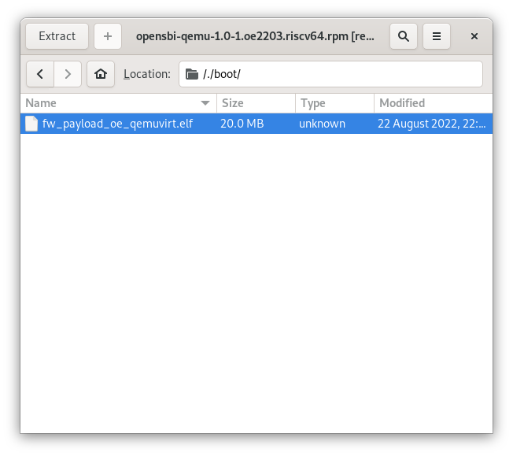

# VLC安装说明

>注：请使用科学上网以查看图片

## 1. 编译安装支持视频输出的QEMU

- 略。详见[通过 QEMU 仿真 RISC-V 环境并启动 OpenEuler RISC-V 系统](https://github.com/openeuler-mirror/RISC-V/blob/master/doc/tutorials/vm-qemu-oErv.md)
- 注：建议优先考虑发行版提供的软件包或在有能力的情况下自行打包，不鼓励非必要情况的编译安装。镜像的安装部分有所不同，请参考以下镜像的下载安装。

## 2. 系统镜像的使用

[使用Unmatched开发板安装RISC-V](https://gitee.com/yunxiangluo/Learn-Risc-V-openEuler-Programming/blob/master/chapter1/lab4/README.md)

### 2.1 镜像下载

#### 2.1.1 下载内容

- 下载 QEMU 目录下的[openeuler-qemu-xfce.qcow2.tar.zst](https://mirror.iscas.ac.cn/openeuler-sig-riscv/openEuler-RISC-V/testing/20220823/v0.1/QEMU/openeuler-qemu-xfce.qcow2.tar.zst),  [start_vm_xfce.sh](https://mirror.iscas.ac.cn/openeuler-sig-riscv/openEuler-RISC-V/testing/20220823/v0.1/QEMU/start_vm_xfce.sh), 
- [下载地址](https://mirror.iscas.ac.cn/openeuler-sig-riscv/openEuler-RISC-V/testing/20220823/v0.1/QEMU/)
- 下载有音频驱动的内核(QEMU目录下内核没有音频驱动，需要更新内核),

直接下载[内核](./fw_payload_oe_qemuvirt.elf)
或Linux用户可下载并直接解压内核，解压后的文件同上面,直接下载[软件包](http://obs-backend.tarsier-infra.com:82/Factory:/RISC-V:/Kernel/22.03/riscv64/opensbi-qemu-1.0-1.oe2203.riscv64.rpm)，找到 fw_payload_oe_qemuvirt.elf并提取，如若点击链接无反应，可尝试在新窗口下打开并刷新下载链接或使用火狐浏览器。若仍无法下载，可参阅附录（通过 QEMU 仿真 RISC-V 环境并启动 OpenEuler RISC-V 系统）相关内容解决



如图，可在下载的rpm包下的"/./boot/"位置中找到此文件，然后选中提取

windows用户建议参阅附录使用WSL来运行，更新内核也在另一篇文章有其他可行的解决方法

#### 2.1.2 部署和启动

#### 2.1.21 直接启动支持xfce的脚本

>已验证启动脚本在 Ubuntu20.04 ，Debian11.4环境下正常运行 

- 确认当前目录内包含`fw_payload_oe_qemuvirt.elf`, 磁盘映像压缩包，和启动脚本`start_vm_xfce.sh`。
- 解压映像压缩包或使用解压工具解压磁盘映像。
- 调整启动参数
- 执行启动脚本

注：解压需要10.7G硬盘空间

```bash
sudo apt install zstd -y
tar -I zstdmt -xvf ./openeuler-qemu-xfce.qcow2.tar.zst
```

- 执行 `bash start_vm_xfce.sh`

注：QEMU下启动Xfce较慢，请耐心等待

脚本图像输出参数方面可能根据宿主机的环境变化而有些不同。若终端报错，可根据终端提醒，对脚本中'-display'与'-device virtio-vga/'两项进行更改，脚本参数更改具体据环境而变，可自行搜索学习，另外的方法为绕过直接图像输出使用vnc或spice等方式登陆远程桌面，详情可见附录(通过 QEMU 仿真 RISC-V 环境并启动 OpenEuler RISC-V 系统)。

#### 2.1.22 使用spice远程连接桌面

>目前该方案测试过的环境包括 WSL1(Ubuntu 20.04.4 LTS and Ubuntu 22.04.1 LTS) , Ubuntu 22.04.1 live-server LTS 和 Debian11.4。

运行脚本中可能会出现‘pa‘报错或没有声音的情况，应该是本地机的qemu加载PulseAudio不成功的原因，可通过使用spice连接远程桌面来避免qemu直接加载PulseAudio而报错，且spice也支持声音共享

- 下载并更换支持 spice 端口的[脚本](./start_vm.sh)。
点开后点击右上角的 raw


复制点开的页面网址就可以使用 wget 了

注意Windows Powershell的wget需要指定输出文件名


或者直接复制脚本代码然后本地新建文本文档然后黏贴另存为.sh文件

- 调整脚本参数并运行脚本，注意此脚本并不会直接打开qemu的图形化窗口，需要使用 spice 连接后才会弹出窗口
- 安装 virt-viewer 并使用 spice 连接虚拟机

linux环境下（以Debian为例）

命令行输入
```bash
sudo apt install virt-viewer            #安装virt-viewer
remote-viewer spice://localhost:12057   #使用spice连接虚拟机
```

windows下
- 安装 Virt-Viewer
点击[此处](https://virt-manager.org/download/)前往下载地址，下载 virt-viewer 11.0 。如果速度较慢请考虑科学上网。

- 连接到 SPICE
粘贴地址点击连接即可。操作界面和远程桌面类似。

## 3. 安装与启动VLC

### 3.1 安装VLC

- 执行下列指令

```bash
dnf install vlc
```

- 安装过程中，有些包可能会已经以依赖的形式被安装了,请忽略此类信息。


### 3.2 启动vlc

- Xfce桌面下打开终端，输入`vlc` 启动 VLC。

```shell
vlc
```

- 点击vlc图标启动VLC，见Application->Multimedia，或Application->Multimedia->vlc

### 附录及参考文章
[在 WSL 通过 QEMU 仿真 RISC-V 环境并启动 OpenEuler RISC-V 系统](https://github.com/ArielHeleneto/Work-PLCT/tree/master/qemuOnWSL) by [ArielHeleneto](https://github.com/ArielHeleneto)

[通过 QEMU 仿真 RISC-V 环境并启动 OpenEuler RISC-V 系统](https://github.com/ArielHeleneto/Work-PLCT/blob/master/awesomeqemu/README.md) by [ArielHeleneto](https://github.com/ArielHeleneto)
 
